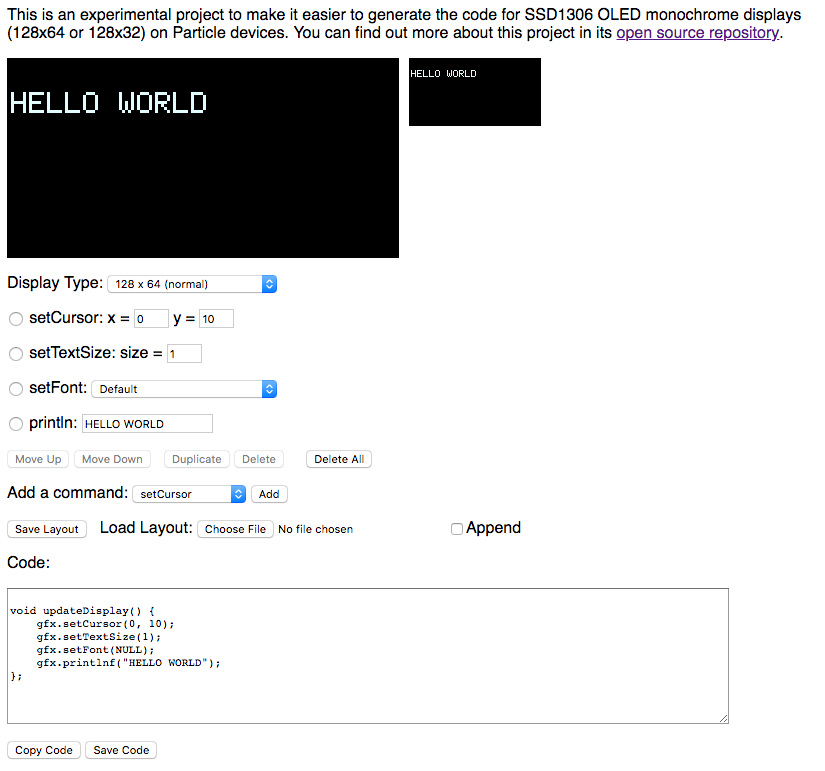
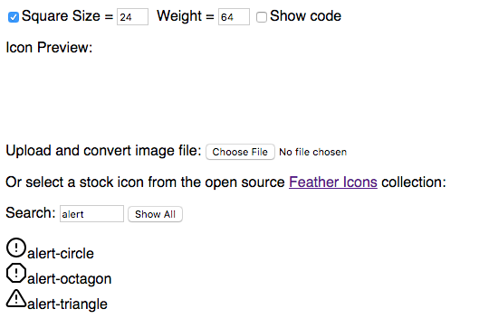
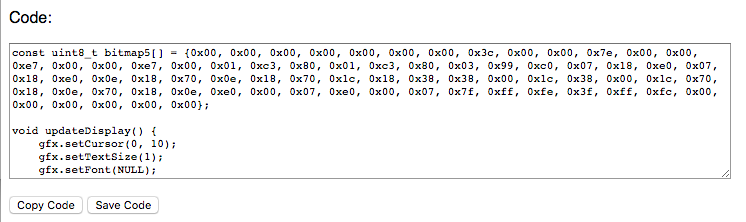
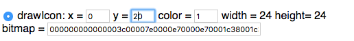

# DisplayGenerator

*Tool to help design SSD1306 OLED displays on Particle devices*

I like to use the SSD1306-based displays in Particle projects. They're small and inexpensive. There are three commonly used versions:

- 128 x 64 white (0.96") 
- 128 x 32 short
- 128 x 64 yellow and blue, with the top 16 pixels yellow and the rest blue

They're available with I2C and SPI interfaces. I recommend I2C; it's fewer pins (D0 and D1 only) and the added speed of SPI is not worth the effort in my opinion.

On Particle devices, the [Adafruit GFX library](https://github.com/adafruit/Adafruit-GFX-Library) is typically used to draw to the display. It works great, but it's kind of a pain to have to adjust a pixel or two, recompile and flash your code, and repeat the process over and over.

This project is a web-based tool that allows you to design your display code from a web browser with instantaneous feedback as you adjust fonts, positions, etc.. This saves a lot of pain over making a code change, flashing it to your device, viewing the display, and repeating.

The code actually runs the Adafruit GFX code in your browser so the display behavior, fonts, etc. are pixel-perfect to an actual device!

To use the tool, go to the [DisplayGenerator Web Page](https://rickkas7.github.io/DisplayGenerator/index.html). It's just the public directory of this repository served by Github Pages.

## What can you do with it?

Here's a sample screen:

At the top is the 3x enlarged display on the left and actual-sized display on the right

The Display Type popup allows you to choose a different display type. It's currently limited to standard SSD1306 monochrome displays.

The list is populated by four commonly used commands, but you can add, delete, and move them as desired.

As you edit the fields, for example change the y value for the setCursor command, the display immediate updates, as does the code box, below.

The add a command feature can be used for writePixel, drawLine, drawRect, fillRect, drawCircle, etc..

Save Layout and Load Layout can be used to save your design so you can load it later and continue to edit it.

Code is the generated code based on your settings.

The other major feature is the icon/bitmap generator. If you add a **drawIcon** command, an additional pane will appear:

You can select size size of the icon. Default is 24 pixels square. It can be from 6 to 64 pixels. You can also select non-square dimensions.

When the icons are scaled they're anti-alised. The weight values determines which gray values will be set. Setting it close to 1 will mean even the lightest gray will be black. Setting it close to 255 will only keep the actual black pixels black.

Normally the code box is hidden when selecting an icon. It will reappear if you select a command other than **drawIcon** or you can use the **Show code** checkbox.

Use **Upload and convert image file** **Choose File** button to upload an image file (gif, jpeg, png, svg). It will be scaled, but it's best if it has the same size and aspect ratio as you've selected for the icon. This is how you convert an image into a bitmap in code.

Or, you can select a pre-made icon from the open-source [FeatherIcons](https://feathericons.com/) collection. 

There are a lot of icons, so you can search by name. If you clear the **Search** text box, all icons will shown.

Click on an icon to select that icon. It will populate the command section at the top, where you can adjust parameters like the position of the icon.

## How it works

The entire thing is browser-based. I tested it in Chrome and Firefox. It might work on Safari. It probably won't work on Edge, and it definitely won't work on Internet Explorer. 

Odds are iffy on mobile, but it doesn't really make sense to use it on a mobile device anyway.

There are two main parts:

- The user interface part is a Vue.js application.
- The Adafruit GFX code runs using Emscripten.

[Emscripten](https://emscripten.org) takes C++ code and compiles it to WebASM. I have the Adafruit GFX library and some necessary utilities (like String) as the C++ source in the src directory. 

Emscripten generates the necessary bindings so I can call C++ code from Javascript. I added wrappers for all of the GFX calls and a call to read the bitmap data out as an array of bytes.

The "program" is just a JSON array with an object for each command like writePixel, drawLine, drawRect, etc.. It's an array so you might have multiple setCursor and drawText commands, for example, in it.

The save and load options read and write this JSON object.

The display generator iterates this array and calls the GFX code with the appropriate parameters to render the display.

It also generates the C++ display code, including the GFX calls, any additional includes, and any bitmap data.

The Javascript code takes the display bitmap and renders it on a HTML5 canvas in normal and zoomed size.

 